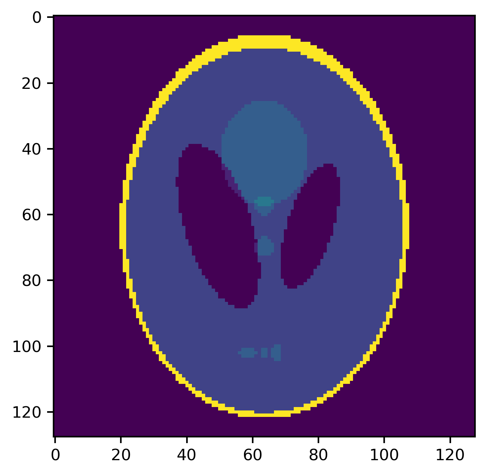
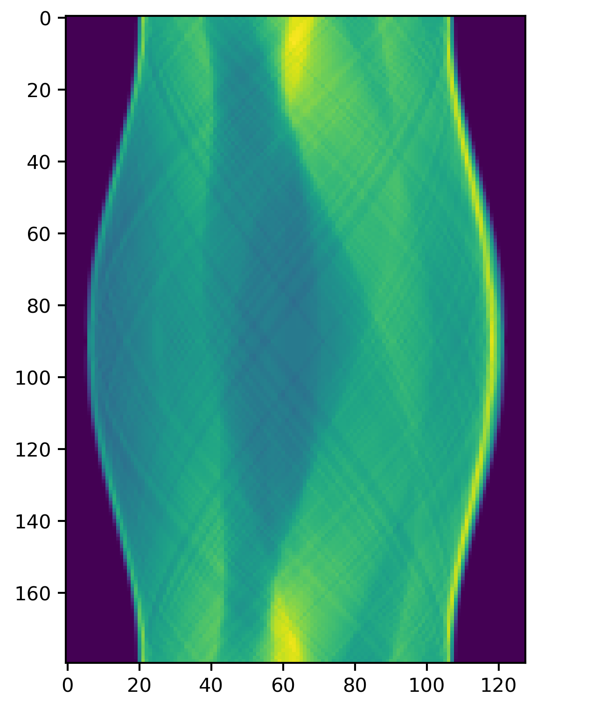

# Computed Tomography Reconstruction: Traditional and Deep Learning Methods

This project explores the field of **inverse problems**, a class of mathematical challenges where the goal is to determine the underlying cause of observed effects, applied to the field of computed tomography (CT). Inverse problems are often **ill-posed**, making direct solutions infeasible and motivates the use of robust reconstruction techniques illustrated in this work. You can read the full report for this work [here](https://github.com/imanfs/inverse-problems-CT-scans/blob/master/report.pdf).

In the context of CT, the inverse problem involves reconstructing the true 2D or 3D image of an object (left) from its projections, which are collected as the object is scanned from multiple angles. These projections can be visualised as **sinograms** (right):

  

Mathematically, this can be expressed as:

$$g = Af_{true} + n$$

where:
- $A$ represents the forward operator, modeling how the image projections are generated,
- $f_{true}$ is the true underlying image to be reconstructed,
- $g$ is the observed data (e.g., sinograms in CT),
- $n$ represents noise introduced during the scanning process.

This project investigates methods for solving the CT reconstruction problem using both traditional methods, such as filtered backprojection (FBP) and wavelet denoising, and modern deep learning approaches. The project addresses challenges such as limited data, missing segments, and noise, providing a comparative analysis of various methodologies.

### Traditional Reconstruction Methods
1. **Radon Transform and Back-Projection**:
   - The Radon transform maps an image into its sinogram representation by integrating along various projection angles.
   - Back-projection is the inverse process, reconstructing the image from the sinogram by redistributing the data along the same projection paths.
   - Unfiltered back-projection creates a blurred image due to the accumulation of low-frequency noise, while filtering in the frequency domain is used to emphasize edges and suppress artifacts.

2. **Matrix Form of the Radon Transform**:
   - The Radon transform can be expressed in a matrix form, where the forward operator maps the image to its sinogram, and the adjoint operator approximates the inverse transform.
   - Singular value decomposition (SVD) is applied to study the properties of the transform, revealing how the information is distributed across singular vectors.
   - Sparse and limited angle cases highlight typical challenges in reconstruction, such as aliasing artifacts and missing data, caused by insufficient or non-uniform sampling.

3. **Matrix-Free Regularized Least-Squares Solver**:
   - Regularized least-squares methods solve the inverse problem by minimizing the residual between the forward-transformed reconstruction and the observed data.
   - Tikhonov regularization imposes smoothness constraints on the solution, with 0-order regularization minimizing intensity variations and 1st-order regularization penalizing large gradients.
   - Krylov subspace solvers like GMRES are used for efficient computation without explicitly constructing large matrices.

4. **Haar Wavelet Denoiser**:
   - Haar wavelet decomposition represents an image as a combination of scaled and shifted wavelet functions, capturing details at various resolutions.
   - The approximation coefficients represent low-frequency information, while detail coefficients capture horizontal, vertical, and diagonal high-frequency features.
   - Thresholding eliminates coefficients below a certain value, effectively removing noise while preserving significant image details. Reconstruction is performed by inverting the wavelet transform.

5. **Iterative Soft-Thresholding**:
   - This iterative approach minimizes the discrepancy between measured sinograms and the forward projection of the reconstruction.
   - Soft-thresholding is applied to the wavelet coefficients at each step to reduce noise while retaining essential structural information.
   - The method integrates optimization and regularization, iteratively refining the reconstruction until convergence.

### Learning-Based Reconstruction
1. **Learned Post-Processing**:
   - A synthetic dataset was created by generating 5 to 20 overlapping ellipses of varying sizes as the `ftrue` target set. Noisy sinograms are created from the ellipses and are used to create noisy reconstructions using filtered backprojection.
   - A convolutional neural network (ResNet) is trained to correct artifacts and noise in initial reconstructions.
   - The network learns a mapping from the noisy input to the true image by minimizing the pixel-wise difference during training.

2. **Learned Model-Based Reconstructions**:
   - This method incorporates the Radon transform and its gradient directly into a learned iterative framework.
   - At each step, the gradient of the data fidelity term is computed and passed through a residual block alongside the image to refine the reconstruction.
   - The approach merges traditional optimization with neural network flexibility, theoretically allowing the model to adaptively learn prior constraints from inverse problems theory.
